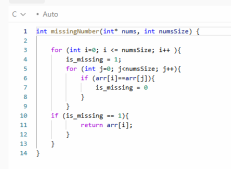

Name: Najib Mosquera
Class: Fall 2025

# Report
Fill out these report questions. 

1. What is the difference between a directed and undirected graph?    
A directed graph has edges that point in one direction only. This means if you have a connection from City A to City B, it does not automatically mean you can travel from B to A. A directed edge behaves like a one way street. In contrast, an undirected graph has edges that work in both directions. If two cities are connected, travel is allowed in both directions automatically. This is like a normal two way road. In this assignment, we used an undirected graph because roads between cities usually go both ways. This allows Dijkstras algorithm to treat each connection as symmetric and simplifies shortest path calculations. [3]
2. What is the Big O of Dijkstra's algorithm.... 
   * Assuming you used an array (or list) to store the vertices.  
   O(V² + E) ≈ O(V²)
   * Assuming you used a heap / priority queue to store the vertices.  
   O((V + E) log V)

3. Explain in your own words what that means for larger graphs when trying to find the shortest distance.   
As graphs become very large like thousands or millions of cities, the time it takes to compute shortest paths grows dramatically depending on how efficient the data structures are. Using an array based Dijkstra O(V²) becomes too slow because scanning through every vertex repeatedly creates millions or billions of operations. Using a priority queue lowers the time significantly, which is why real systems like Google Maps must use optimized data structures. When graphs are huge, every improvement such as avoiding full scans, storing adjacency lists efficiently, and caching results makes a dramatic difference in performance. [2]  

## Deeper Thinking
4. For this assignment, you didn't need the most "efficient" set of data structures (for example, a heap wasn't required). However, think on the scale of google/apple maps - they have to deal with millions of vertices and edges. What data structures would you use to store the graph? Why? Somethings to consider - would you be able to store the entire graph at a time? Could you break it up into smaller pieces? How would you do that? Would there be advantages to caching/memoization of paths? You are free to explore your thoughts on this subject/reflect on various ideas. Other than a realization of some scalability of problems, there isn't a wrong answer.   
Real world map systems handle millions of vertices through cities, intersections and tens of millions of edges, roads. They cannot store a full adjacency matrix because that would require V^2 memory, which becomes impossible for large V. Instead, they almost always use an adjacency list because it stores only the edges that actually exist, making it memory efficient. [4]

They also break the world into regions or tiles, loading only part of the graph at a time. This helps avoid storing the entire world map in memory. Algorithms like Dijkstra are combined with more advanced ones such as A* search, bidirectional search, and contraction hierarchies, which dramatically speed up the search.

Caching and memoization are common. For example, if many users search for the same popular routes like between major cities, the shortest path can be saved temporarily to avoid recomputing it. Modern systems also use techniques like preprocessing road networks into highway hierarchies, allowing fast long distance routing. [10] [11] Overall, real map systems use a combination of adjacency lists, priority queues, region based graph partitioning, caching, heuristic search like A*, and graph compression / preprocessing. This lets them answer route queries in milliseconds.

## Future Understanding

5. Related to shortest distance, is a problem called the "messenger" or "traveling sales person" problem commonly abbreviated to TSP. This problem is to find the shortest path that visits **every** vertex in a graph. Another way to look at it, is you are an delivery driver, and you have a series of packages to deliver. Can you find an optimal path for your deliveries that minimizes the total distance traveled?  
With N stops, the number of possible route is N!  
 Imagine if you had 5 stops. How many different paths are there?  There are 120 possible paths to look at! (assuming fully connected routes). 
   * How many possible paths are there if you have 6 stops?  
     720 possible paths
   * How many possible paths are there if you have 10 stops?  
     3,628,800 possible paths  

This explosion makes brute force search impossible for large N. [12]  
6. What type of growth is this problem?  
Traveling Salesperson Problem ,TSP, grows factorially written as O(N!).  It is a great problem to see the paths. Factorial growth is even faster than exponential growth. Problems with factorial complexity become impossible to compute exactly once N gets even moderately large as an example of N = 20. This is why TSP is considered computationally hard. [12]  
  
7. Take some time to research TSP problems. It falls under a certain classification of problems? What is it?  
The Traveling Salesperson Problem is part of the class of: NP hard optimization problems and the decision version is there a tour ≤ K distance? is np complete. This means there is no known polynomial time algorithm to solve it perfectly. It is widely believed that none exists. It is one of the most studied problems in computer science. [12]   
8. Provide some examples of fields / problems that use TSP.  
TSP appears in many real world applications - Delivery and logistics like Amazon, UPS, FedEx routing. In ride sharing optimization like Uber, Lyft pickups. Manufacturing like in minimizing movement of robotic arms. Circuit board drilling - ordering drill holes efficiently. DNA sequencing finding shortest superstrings. Astronomy telescope lens repositioning. Travel route planning vacation optimization apps. Even though TSP is NP-hard, many industries rely on approximation algorithms to find good enough solutions in reasonable time. [12]

> [!TIP]
> We are having you explore TSP, so you can see the terms used for problem classification that are often the foundation of computer science theory. You will not be asked to know about TSP outside of this assignment or even problem classification. Computer Science is often about dealing with problems considered "too hard" or "impossible", and finding ways to make them possible! As such, knowing topics such as N, NP, NP-Complete, etc. is important to understand the limits (to break).

## Technical Interview Practice Questions
For both these questions, are you are free to use what you did as the last section on the team activities/answered as a group, or you can use a different question.

1. Select one technical interview question (this module or previous) from the [technical interview list](https://github.com/CS5008-khoury/Resources/blob/main/TechInterviewQuestions.md) below and answer it in a few sentences. You can use any resource you like to answer the question.  
268 Missing Number
  

2. Select one coding question (this module or previous) from the [coding practice repository](https://github.com/CS5008-khoury/Resources/blob/main/LeetCodePractice.md) and include a c file with that code with your submission. Make sure to add comments on what you learned, and if you compared your solution with others.  
Explain what a hash table is. What is the process of hashing?  A hash table is a data structure that stores key value pairs and provides very fast access by using a computed index instead of searching. Hashing is the process of applying a hash function to a key to turn it into a number, which is then mapped to an index in an array. If two items map to the same index, collision handling techniques are used.      

## Resources
[1] Tutorialspoint. C Library Function strtok() (accessed 2025).
https://www.tutorialspoint.com/c_standard_library/c_function_strtok.htm  
[2] GeeksforGeeks. Dijkstra’s Shortest Path Algorithm (2025). 
https://www.geeksforgeeks.org/dijkstras-shortest-path-algorithm-greedy-algo-7/  
[3] Wikipedia. Adjacency Matrix (2025).
https://en.wikipedia.org/wiki/Adjacency_matrix  
[4] Wikipedia. Adjacency List (2025).
https://en.wikipedia.org/wiki/Adjacency_list  
[5] Cormen, Leiserson, Rivest, Stein. Introduction to Algorithms, MIT Press, 3rd Ed. (2009).  
[6] T. H. Cormen. Dijkstra’s Algorithm Lecture, MIT OpenCourseWare.  
[7] Google Research. Highway Hierarchies and Fast Routing (2010).  
[8] Sanders & Schultes. Engineering Highway Hierarchies. ACM Journal of Experimental Algorithmics (2007).  
[9] Hart, Nilsson, Raphael. A Formal Basis for the Heuristic Determination of Minimum Cost Paths. IEEE Trans. Systems Science and Cybernetics, 1968.  
[10] Geisberger et al. Contraction Hierarchies: Faster and Simpler Hierarchical Routing. ACM Journal of Experimental Algorithmics (2008).  
[11] OSRM Project. Open Source Routing Machine Documentation (2025).  
[12] Wikipedia. Travelling Salesman Problem (2025).
https://en.wikipedia.org/wiki/Travelling_salesman_problem  